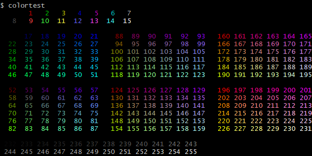
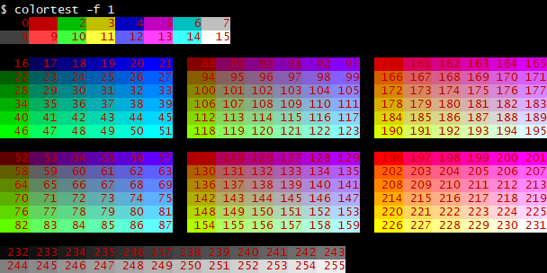
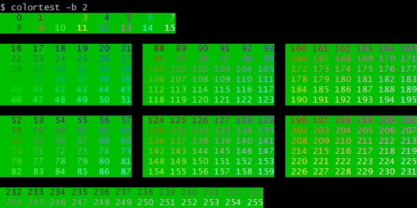

# colortest
color test program by Nim

## Installation

```
$ git clone https://github.com/z-kk/colortest.git
$ cd colortest
$ nimble install
```

## Usage

default view



fix fgcolor by using -f option



fix bgcolor by using -b option


